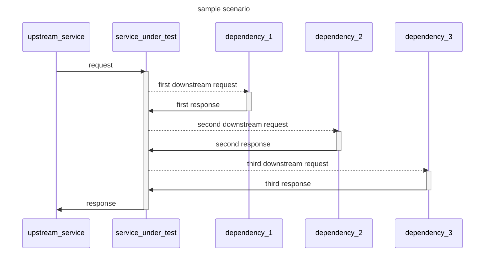
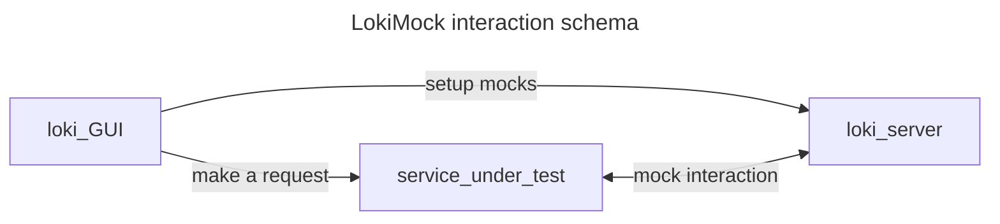
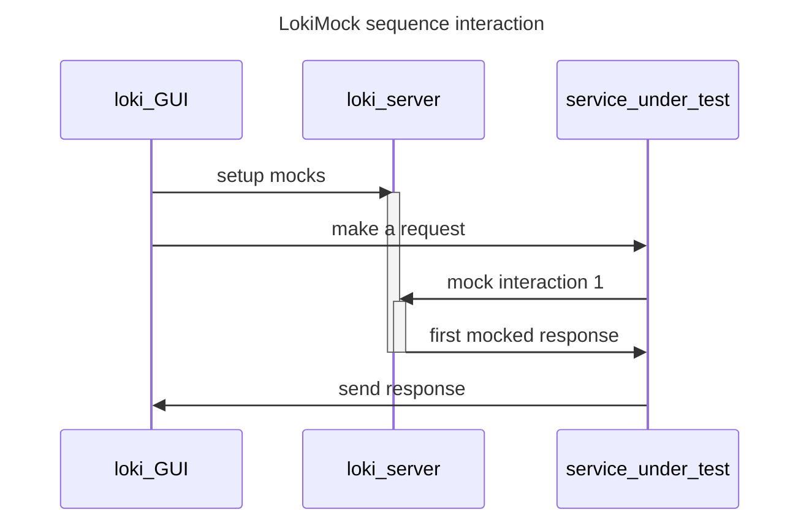

# LokiMock

This want to be a simple tool to simplify manual quality assurance of rest services/API.   

## Reasoning

This tool want to fill a gap in software testing. While it's relatively easy to build automatic tests from an 
engineering point of view it's very difficult to simulate all the possibles scenarios and spot edge cases when the 
service under test is part of a complex constellation.

This tool aim to offer an easy simple web interface to simulate a service call offering a configurable single use mock 
for dependencies of the service under test.

## Tech stack

The system is a full-stack web applications build with [Kotlin multiplatfor](https://kotlinlang.org/docs/multiplatform.html#full-stack-web-applications).
The backend is in native kotlin with Ktor server as base. 
The frontend is in react but built using Kotlin wrapper.

## Planned features 

- [x] Visualize json correctly formatted (Json editor library JS)
- [ ] Show endpoint response
- [ ] Add support for response matchers
- [ ] GUI should be statically configured from a JSON file

  The final setup should be similar to this [one](./documentation/sampleConfiguration.json)
  ([json schema definition](./documentation/configurationSchema.json))
- [ ] Receive graphical feedback of the called mocked endpoints

  The idea is to color code the mocks in the gui
    - Red -> endpoint not called
    - Yellow -> endpoint called but request didn't match the expectation
    - Green -> endpoint called with the expected request

  Possible implementations are with **SSE** or **Web Sockets**
- [ ] Add Docker deploy
- [ ] Add support for graphQL dependencies.
  - GraphQL's responses are already in Json thus the issue is more on the request matcher.  

    